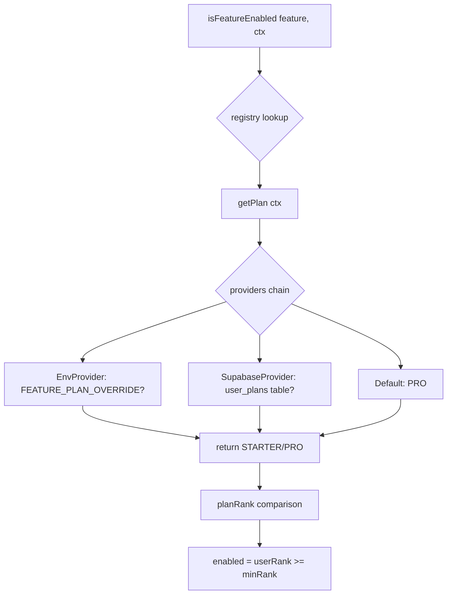

# Sistema de Planes y Feature Flags

## Visión General

Este sistema permite gestionar planes de usuario (STARTER vs PRO) y features opcionales mediante feature flags. Actualmente implementa el sistema de planes con las siguientes características:

- **STARTER**: Solo muestra los 4 dominios core (Clientes CRUD, Préstamos CRUD, Recordatorios de Cobros, Configuración de Intereses)
- **PRO**: Muestra todos los módulos incluyendo analytics, wallet overview, y database indicator

## Arquitectura

### Componentes Principales

| Archivo | Descripción |
|---|---|
| `types/features.ts` | Tipos strictos para `Plan`, `FeatureKey`, y estructura del registry |
| `lib/features/registry.ts` | Registry central con `isFeatureEnabled(key, ctx)` para verificar features |
| `lib/features/guard.ts` | Guards con 503 para proteger endpoints y server actions |
| `lib/features/providers/env-provider.ts` | Provider para override via `FEATURE_PLAN_OVERRIDE` |
| `lib/features/providers/supabase-plan-provider.ts` | Provider para consultas DB multi-tenant por usuario |
| `components/feature-flag.tsx` | Server Component wrapper `<FeatureFlag feature="...">` |
| `scripts/003_create_user_plans_table.sql` | DDL idempotente para tabla `user_plans` |

### Flujo de Resolución



## Uso

### 1. Configurar Tabla en Supabase

Ejecutar el script SQL `scripts/003_create_user_plans_table.sql` en el SQL Editor de Supabase (QA y production):

```sql
-- user_plans table con RLS por user_id
create table if not exists user_plans (
  user_id uuid primary key,
  plan text not null check (plan in ('STARTER', 'PRO')),
  created_at timestamptz not null default now(),
  updated_at timestamptz not null default now()
);
```

### 2. Asignar Planes a Usuarios

```sql
-- Asignar plan PRO a un usuario
insert into user_plans (user_id, plan) values ('uuid-del-usuario', 'PRO');

-- Asignar plan STARTER a un usuario
insert into user_plans (user_id, plan) values ('uuid-del-usuario', 'STARTER');

-- Eliminar fila para revertir a default PRO
delete from user_plans where user_id = 'uuid-del-usuario';
```

### 3. Gating en Server Component

```tsx
import { FeatureFlag } from '@/components/feature-flag'

export default async function Page() {
  return (
    <div>
      <FeatureFlag feature="analytics.dashboard">
        {/* Contenido PRO: dashboards */}
        <DashboardFinanciero />
        <DashboardRiesgo />
        <DashboardClientes />
      </FeatureFlag>
      
      <FeatureFlag feature="ui.database-indicator">
        {/* Badge de ambiente solo PRO */}
        <DatabaseIndicator />
      </FeatureFlag>
    </div>
  )
}
```

### 4. Gating en Server Actions

```tsx
'use server'
import { requireFeature } from '@/lib/features/guard'
import { createServerContext } from '@/lib/features/guard'

export async function generarReporte() {
  // Lanza FeatureDisabledError (503) si feature no habilitada
  await requireFeature('reports', createServerContext(userId, supabase))
  
  // Lógica de generación de reporte...
}
```

### 5. Override en Desarrollo

Añadir en `.env.local` para forzar un plan específico:

```bash
# Forzar STARTER
FEATURE_PLAN_OVERRIDE=starter

# Forzar PRO
FEATURE_PLAN_OVERRIDE=pro
```

## Feature Keys Disponibles

```ts
type FeatureKey = 
  | 'analytics.dashboard'     // Tab "Cuenta" con 3 dashboards
  | 'analytics.wallet'        // WalletOverview
  | 'ui.database-indicator'   // Badge ambiente
```

Todas requieren plan PRO.

## Planes y Permisos

| Feature | minPlan | STARTER | PRO |
|---|---|---|---|
| analytics.dashboard | PRO | ❌ | ✅ |
| analytics.wallet | PRO | ❌ | ✅ |
| ui.database-indicator | PRO | ❌ | ✅ |
| **Core (Clientes, Préstamos, Cobros, Interés)** | STARTER | ✅ | ✅ |

## Errores y HTTP 503

Cuando un feature está deshabilitado:

- **UI**: `<FeatureFlag>` renderiza `fallback` (default: `null`)
- **Server Actions**: `requireFeature` lanza `FeatureDisabledError` (status=503, code=503)
- **API Routes**: `withFeatureRoute` devuelve `NextResponse.json({error:'Service Unavailable',code:503},{status:503})`

## Testing

Ejecutar tests unitarios:

```bash
npm run test:features
```

Tests cubren:
- Registry y resolución de planes
- Providers (env y Supabase)
- Guards con 503
- `isFeatureEnabled` y `getEnabledFeatures`

## Notas

- El default es PRO si no existe fila en `user_plans` (versión actual sin restricciones)
- Los providers se ejecutan en cadena: env → supabase → default
- La tabla `user_plans` usa RLS para seguridad multi-tenant por `user_id`